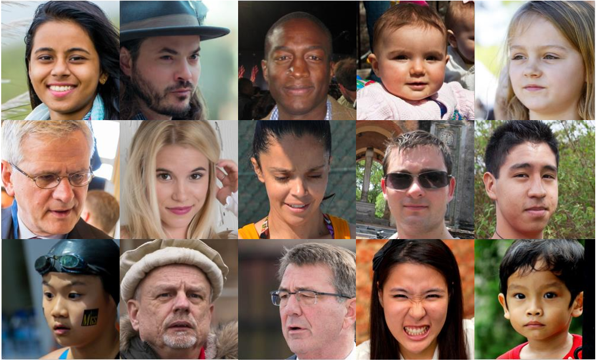
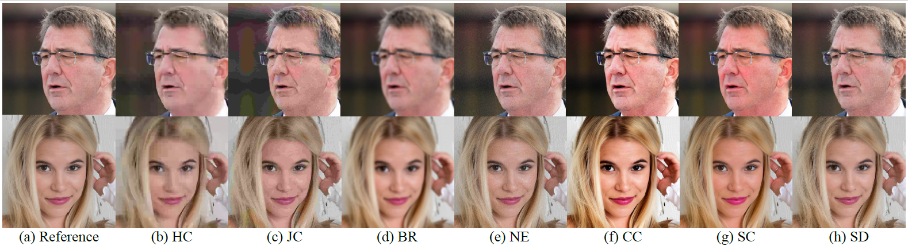

# FIQA
This repository is for our paper.

==========================================================================================================

-----------COPYRIGHT NOTICE STARTS WITH THIS LINE------------

Copyright (c) 2022, Beihang University, China.

All rights reserved.

## License
Permission to use, copy, or modify this database and its documentation for educational and research purposes only and without fee is hereby granted, provided that this copyright notice and the original authors' names appear on all copies and supporting documentation. This program shall not be used, rewritten, or adapted as the basis of a commercial software or hardware product without first obtaining permission of the authors. The authors make no representations about the suitability of this software for any purpose. It is provided "as is" without explicit or implied warranty.

## Database
Our FIQA database is a large-scale database of face image for visual quality assessment. There are in total 42,125 face images with
rich content at different distortion types in the database. In our FIQA database, some examples of the reference face images are shown in the figure below.

Some examples of the distorted face images are shown in the figure below.

The database is password protected. Please send a download application email to liutie@buaa.edu.cn together with your name, affiliation and usage. Thanks a lot!

## Reference
- Z. Pan, F. Yuan, J. Lei, Y. Fang, X. Shao, and S. Kwong, “Vcrnet: Visual compensation restoration network for no-reference image quality assessment,” IEEE Transactions on Image Processing, 2022.
- H. Zhu, L. Li, J. Wu, W. Dong, and G. Shi, “Metaiqa: Deep metalearning for no-reference image quality assessment,” in Proceedings of the IEEE/CVF Conference on Computer Vision and Pattern Recognition, 2020, pp. 14 143–14 152.
- K. Zhang, D. Li, W. Luo, J. Liu, J. Deng, W. Liu, and S. Zafeiriou, “Edface-celeb-1 m: Benchmarking face hallucination with a million-scale dataset,”
IEEE Transactions on Pattern Analysis and Machine Intelligence, 2022.
- H. Lin, V. Hosu, and D. Saupe, “Kadid-10k: A large-scale artificially distorted iqa database,” in 2019 Eleventh International Conference on Quality of Multimedia Experience (QoMEX). IEEE, 2019, pp. 1–3.

## Acknowledgement

